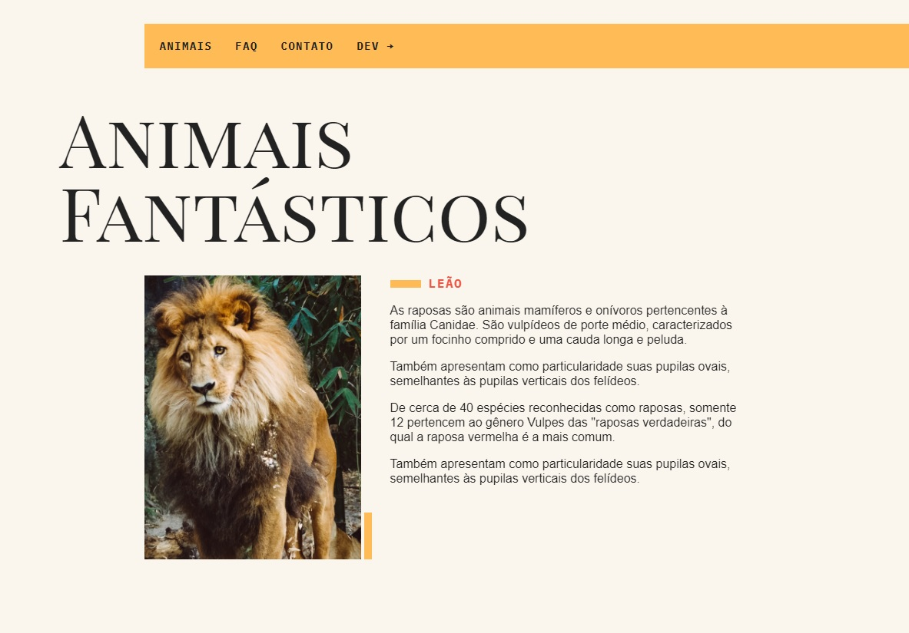
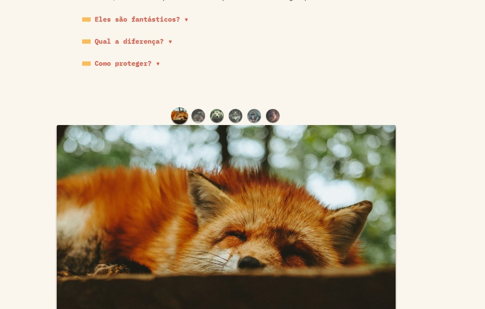
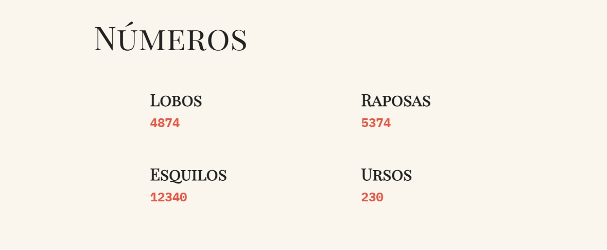
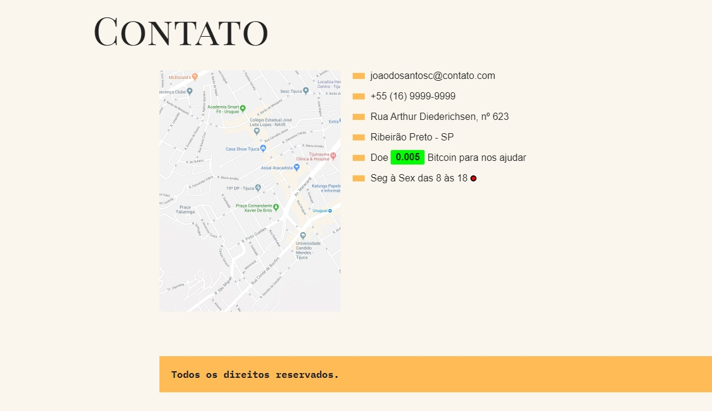
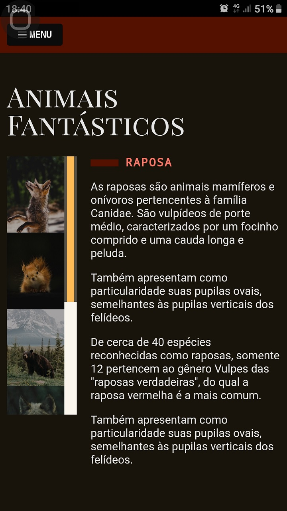
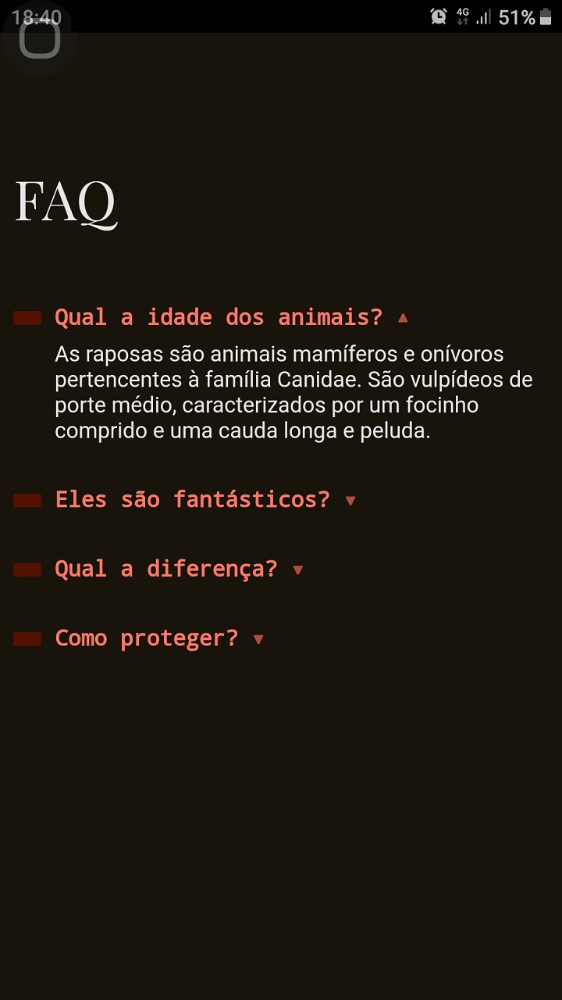
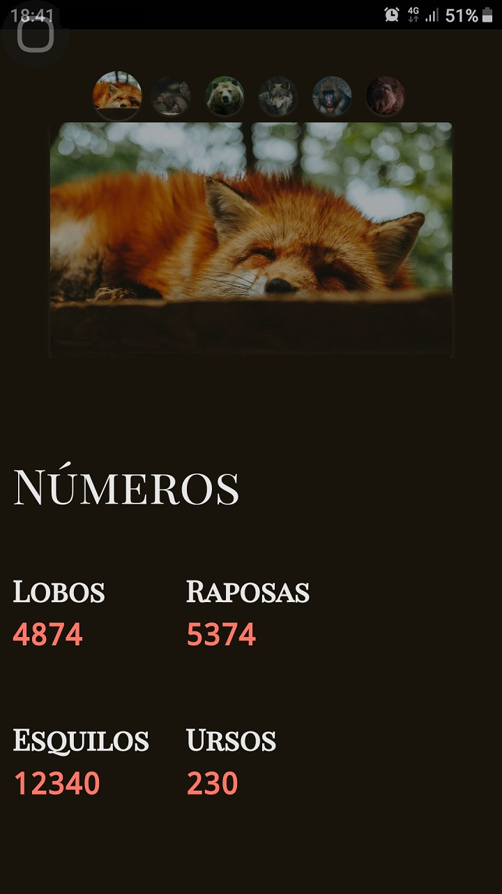
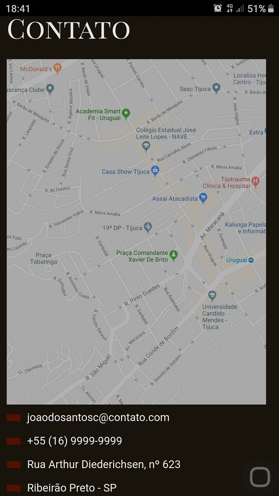

<h2>Hello ❕</h2>
<h3>➡️This project was developed using <strong>HTML5, CSS & JavaScript</strong> 🛠️</h3>

➡️Developed during Origamid JS classes.

<h3>Desktop 🖥️</h3>
</img>
 
</img>
 
</img>
 
</img>

<h3>Mobile 📱</h3>

</img>
 
</img>
 
</img>
 
</img>

 There was applied here my knownledges in HTML5, CSS & JavaScript with DOM manipulation, creating effects and a better visual experience for the final user.

<h3>The path of the project was to clearly apply the most used and up-to-date concepts used in this language, without any kind of framework.</h3>

Concepts were also used to improve UI/UX, ensuring the responsiveness and speed of the application 💻🖥️📱

<h3>The project has concepts like:</h3>
<ul>
  <li>Fetch for local and external API's in JSON format 🔧</li>
  <li>A plugin slide writted 100% in pure JavaScript to generate an image galery 🖼</li>
  <li>Accordion List ⬇</li>
  <li>Smooth scrolling in internal links ⬇</li>
  <li>Dropdown Menu ⬇</li>
  <li>Menu Mobile 📱<small>["hamburguer"]</small></li>
  <li>Modal pop-up 🔧</li>
  <li>Tooltip 📍</li>
  <li>Organics/Dinamics animations 🧑‍💻</li>
</ul>

ATT: 07/14/2021 - 👨‍💻 João Vítor Carvalho

ATT: 08/04/2021 - entire code refactored do be tottaly customized, bugs on interface fixed, and added some CSS and HTML touches - 👨‍💻 João Vítor Carvalho
 
<em>'This project has no commercial purposes, it was carried out only for the application of my studies'📚</em>

<strong>----João Vítor Carvalho 👨‍💻 ---</strong>
