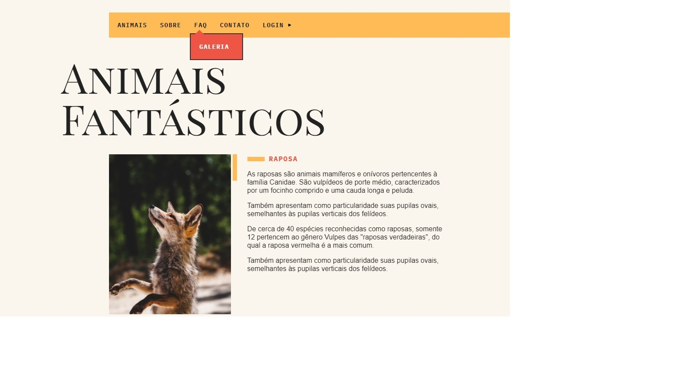

<h2>Olá ❕</h2>
<h3>➡️Este projeto foi criado usando <strong>HTML5 e CSS, JavaScript</strong> 🛠️</h3>

➡️Criado durante o curso de JavaScript da Origamid.

</img>
 
</img>

Foi aplicado aqui meus conhecimentos de HTML5, CSS, JavaScript  manipulando do DOM, gerando efeitos e uma melhor experiência visual para o usuário.

Também foram ultilizados conceitos para melhorar UI/UX, presando pela responsividade e rapidez da aplicação 💻 🖥️📱

<h3>Este projeto possui conceitos como:</h3>
<ul>
  <li>Dropdown Menu ⬇</li>
  <li>Menu Mobile 📱<small>[hamburguer]</small></li>
  <li>Modal pop-ups ⚙</li>
  <li>Tooltips 📍</li>
  <li>Animações orgânicas/dinâmicas 🧑‍💻</li>
</ul>
<small>ATT: 14/07/2021 - João Vítor Carvalho</small>
<em>'Este projeto não possui fins comerciais, foi realizado somente para aplicação de estudos'📚</em>

<strong>----João Vítor Carvalho 👨‍💻 ---</strong>
